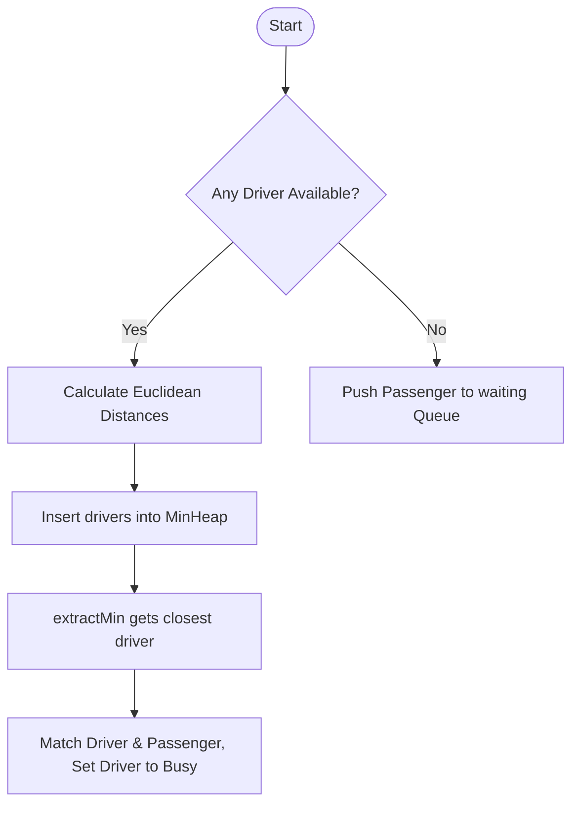

# Ride Booking System in C++

A backend simulation of a ride-sharing booking platform (like Uber or Lyft) implemented in C++. This project demonstrates the practical application of custom data structures and algorithm design to solve real-world problems.

---

## 🚀 Key Features

* **Custom Min-Heap Matching**: Implements a custom binary Min-Heap to find and match a passenger with the closest available driver in $O(\log N)$ time based on Euclidean distance.
* **Custom FIFO Waitlist Queue**: Implements a custom dynamic Queue structure to buffer waitlisted passengers when all drivers are busy.
* **Auto-Assignment Loop**: Automatically assigns a completing driver to the next passenger in the waiting queue, ensuring continuous booking flow.
* **Interactive CLI Menu**: A robust, validation-secured command-line interface to register drivers/passengers, request rides, and track real-time statuses.

---

## 🛠️ Tech Stack & Data Structures

* **Language**: C++11 (using standard templates)
* **Custom Data Structures**:
  * `MinHeap`: Custom binary min-heap for priority matching.
  * `Queue`: Custom dynamic FIFO queue.
  * `Driver`: Class representing driver details, location, status, and rating.
  * `Passenger`: Class representing passenger details, pickup, and destination location.
  * `RideSystem`: Main coordinator class managing active rides and entities.

---

## 📊 System Architecture & Flow

The operational flow of a ride request and matching process is structured as follows:



---

## 💻 How to Compile and Run

Make sure you have a C++ compiler (like GCC/g++) installed on your system.

### 1. Compile the Project
Open your terminal in the project directory and run:
```bash
g++ -std=c++11 -I. main.cpp Driver.cpp Passenger.cpp Queue.cpp MinHeap.cpp RideSystem.cpp -o main.exe
```

### 2. Run the Application
Execute the compiled binary:
```bash
# On Windows
.\main.exe

# On macOS/Linux
./main.exe
```

---

